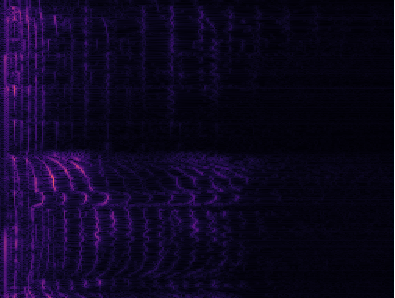

# 🔉 Sounds & Short-Time Fourier Transforms

This project experiments with calculation and visualizations of STFTs in Rust.

## Bucket list

- [x] Implement an example with multiple overlaid frequencies.
- [x] Implement simple audio generation example.
- [x] Implement different windowing functions.
- [ ] Implement a frequency sweep to better visualize the STFT.
- [ ] Map microphone input to the display.
